# Geometry of Affect: Decoding and Manifold Analysis of 27 Fine-Grained Emotions from Human EEG

[](https://www.python.org/downloads/)
[](https://opensource.org/licenses/MIT)
[](https://github.com/)
[](tests/)

Author: Dhruv Kithany  
Institution: University of Wisconsin-Madison  
Application: Exploratory Research Exercise: Computational Neuroengineering, Machine Learning & Geometric Data Analysis (Bhaskar Lab)  
Dataset: [EEGEmotions-27 Dataset](https://github.com/huytungst/EEGEmotions-27) (*IEEE Access*, 2025)

---

## Quick Summary/Overview

Human emotions are complex. Classical psychology debated whether emotions fit into simple separate boxes (like 6 basic emotions) or continuous 2D axes (like Valence and Arousal). Recent work by [Cowen & Keltner (PNAS, 2017)](https://doi.org/10.1073/pnas.1702247114) showed that emotions actually form a continuous, high-dimensional space spanning 27 distinct categories.

This project investigates a central question:  
> Does the geometric manifold of human scalp EEG reflect the high-dimensional structure of emotional experience, and can fine-grained affective states be decoded across unseen human subjects?

Using the newly released EEGEmotions-27 dataset (88 participants, 14 channels at 128 Hz recorded during video trials), this repository implements an end-to-end pipeline covering signal processing, manifold learning, Representational Similarity Analysis (RSA), subject-independent decoding benchmarks, and class-conditional generative models.


```
         +---------------------------------------------+
         |    EEGEmotions-27 Raw Data (88 Subjects)    |
         +---------------------------------------------+
                                |
                                v
             +-------------------------------------+
             |  Feature Extraction (33 x 14 = 462) |
             | - Spectral Powers (Delta..Gamma, RBA|
             | - Entropies (Shannon, Renyi, Tsalli)|
             | - Non-linear Dynamics & Hjorth Mob. |
             +-------------------------------------+
                                |
               +-------------------+-------------------+
               |                                       |
               v                                       v
+-----------------------------+         +-----------------------------+
| 1. Neurobiology & Topology  |         |  2. Manifold Learning & RSA |
+-----------------------------+         +-----------------------------+
| - 10-20 Scalp Interpolation |         | - Diffusion / Eigenmaps     |
| - Frontal Alpha Asymmetry   |         | - RSA vs Circumplex (p=.007)|
| - Multi-Band Spatial Power  |         | - Two-NN Intrinsic Dim=13.4 |
| - Welch Power Spectral Den. |         | - Ward Hierarchical Tree    |
+-----------------------------+         +-----------------------------+
               |                                       |
               v                                       v
+-----------------------------+         +-----------------------------+
| 3. Subject-Independent ML   |         | 4. Conditional Generator    |
+-----------------------------+         +-----------------------------+
| - Strict Leave-Subjects-Out |         | - Ledoit-Wolf Covariance    |
| - 4-Class Quadrants (56.6%) |         | - Synthetic Sample Synthesis|
| - 27 Fine-Grained Emotions  |         | - Frechet Distance (FD) Eval|
|   (30.8% Top-1, 79.8% Top-5)|         | - Mode Collapse-Free Prior  |
+-----------------------------+         +-----------------------------+
```

---

## Repo Diagram (What is actually included) (Key--> rendered quatro pdf (as a formal memo in the structure I have done in the past) is listed as "index.pdf")

```
                          +-----------------------------+
                          |      Key Repo Aspects       |
                          +-----------------------------+
                                         |
            +----------------------------+----------------------------+
            |                            |                            |
            v                            v                            v
+------------------------+   +------------------------+   +------------------------+
| Research Memo & Report |   |  Core Python Packages  |   |  Reproduction Script   |
|        (memos/)        |   |     (eeg_affect/)      |   |  (scripts/ & run_all)  |
+------------------------+   +------------------------+   +------------------------+
| - index.pdf (formal)   |   | - data/: loaders/splits|   | - 01_neurobiology      |
| - index.html (web ver) |   | - features/: PSD, FAA  |   | - 02_manifold_rsa      |
| - Quarto publication   |   | - geometry/: Manifold  |   | - 03_decoding_bench    |
| - Math proofs & theory |   | - models/: classifiers |   | - 04_synthetic_gen     |
| - Full bibliography    |   | - generative/: synth   |   | - Master run_all.py    |
+------------------------+   +------------------------+   +------------------------+
            |                            |                            |
            +----------------------------+----------------------------+
                                         |
            +----------------------------+----------------------------+
            |                            |                            |
            v                            v                            v
+------------------------+   +------------------------+   +------------------------+
|      Walkthrough       |   |Figures & Benchmark Stats|   |    Automated Tests     |
|      (notebooks/)      |   |       (figures/)       |   |        (tests/)        |
+------------------------+   +------------------------+   +------------------------+
| - 01_exploratory_demo  |   | - 14 pub 300-DPI plots |   | - tests/run_tests.py   |
| - End-to-end tutorial  |   | - Scalp topomaps & PSDs|   | - 15 unit tests pass   |
| - In-browser topomaps  |   | - Manifold 2D/RSA plots|   | - Math/shape assertions|
| - Live FAA inspection  |   | - 3 JSON benchmark logs|   | - Zero external deps   |
| - Manifold projections |   | - All pipeline outputs |   | - Verified 100% green  |
+------------------------+   +------------------------+   +------------------------+
```

Here is an overview of what is provided across each module:

* Research Memo and PDF Report (memos/):
  A full research memo compiled with Quarto to both PDF and HTML format at memos/2026-09-07-eeg-affect-manifold-geometry/index.pdf (and index.html). It details the mathematical foundations, neurobiology background, manifold geometry analyses, and decoding benchmarks with full academic citations.

* Core Python Package (eeg_affect/):
  A modular library containing data loaders, preprocessors, spectral and asymmetry feature extraction, geometric manifold algorithms (Diffusion Maps, PCA, Two-NN, RSA), classification models, and class-conditional synthetic EEG generators.

* Standalone Reproduction Scripts (scripts/ and run_all.py):
  Four clean scripts (scripts/01 to 04) covering each experimental direction, plus a master runner (run_all.py) that executes the entire four-stage pipeline end-to-end in about 67 seconds.

* Interactive Jupyter Walkthrough (notebooks/):
  A step-by-step tutorial notebook (notebooks/01_exploratory_eeg_affect_walkthrough.ipynb) demonstrating dataset loading, Frontal Alpha Asymmetry calculations, 2D manifold embeddings, and synthetic EEG feature generation.

* Publication Figures and Benchmark Metrics (figures/):
  All 17 generated artifacts (14 high-resolution 300-DPI figures and 3 JSON metric summaries) produced directly by the reproduction pipeline.

* Automated Unit Test Suite (tests/):
  Fifteen unit tests (run via python tests/run_tests.py) covering data loading, feature engineering, geometry algorithms, and decoding models with zero external test runner dependencies.

---

## Key Findings

1. Neural Geometry Correlates with Psychological Affective Space (p = 0.007):
   - Using Representational Similarity Analysis (RSA), we computed pairwise centroid distances between all 27 emotion classes in the 462-dimensional feature space and compared them with normative Valence-Arousal coordinates.
   - Distance correlation revealed a statistically significant alignment (r = 0.1420, p = 7.70e-3; Spearman rho = 0.1431, p = 7.25e-3). This shows that brain wave feature distances preserve the topological layout of human emotional experiences.

2. Intrinsic Manifold Dimensionality:
   - Applying the Two-NN algorithm ([Facco et al., Sci. Rep. 2017](https://doi.org/10.1038/s41598-017-11873-y)) showed that the true intrinsic dimensionality of the EEG affective manifold is d ≈ 13.4.
   - Roughly 97% of the 462 ambient features are redundant or noise. PCA variance shows that 5 components capture 80% variance, 9 capture 90%, and 14 capture 95%, matching the 14 physical electrodes.

3. Frontal Alpha Asymmetry (FAA) Reflects Motivational Direction:
   - Quantified prefrontal lateralization via the alpha paradox: FAA = ln(Alpha_AF4) - ln(Alpha_AF3). When brain regions activate, alpha power drops.
   - Positive FAA indicates left prefrontal activation (approach motivation, positive valence) for emotions like Joy, Excitement, and Craving.
   - Negative FAA indicates right prefrontal activation (avoidance motivation, negative valence) for emotions like Sadness, Fear, and Disgust.

4. Decoding Benchmark on Strict Subject-Independent Splits (Zero Data Leakage):
   - Evaluated under strict Leave-Subjects-Out (GroupKFold) across 74 training subjects and 14 unseen holdout subjects:
     - 4-Class Quadrant Decoding: Random Forest hits 56.64% accuracy (chance: 25.0%, Top-3: 98.12%).
     - 27-Class Emotion Decoding: Random Forest achieves 30.83% Top-1 accuracy, 65.13% Top-3 accuracy, and 79.83% Top-5 accuracy (an 8.3-fold increase over the 3.70% random chance baseline).

5. Class-Conditional Synthetic EEG Generation:
   - Implemented a generative model with Ledoit-Wolf covariance shrinkage modeling p(X | y = c) = N(mu_c, Sigma_c). This fixes sample covariance singularity in 462D and enables synthetic trial sampling with low Frechet distances (FD = 116.88 for Sadness, FD = 401.60 for Anger).


---

## Subject-Independent Decoding Benchmark

All models were evaluated under strict subject-independent splitting (`GroupShuffleSplit`, random state 42) ensuring that no subject's time-series or segments appear in both training and testing.

### Task A: 4-Class Valence-Arousal Quadrants (Chance = 25.0%)
| Model | Test Accuracy | Balanced Acc | Macro F1 | Weighted F1 | Cohen's Kappa | Top-3 Acc | Fit Time (s) |
| :--- | :---: | :---: | :---: | :---: | :---: | :---: | :---: |
| Random Forest | 56.64% | 44.86% | 0.4340 | 0.5446 | 0.3639 | 98.12% | 5.97s |
| Extra Trees | 53.79% | 42.58% | 0.4094 | 0.5162 | 0.3239 | 95.67% | 0.61s |
| Deep MLP Neural Net | 50.20% | 42.98% | 0.4315 | 0.4909 | 0.2793 | 96.70% | 20.45s |
| Logistic Regression (L2)| 42.11% | 33.54% | 0.3144 | 0.3910 | 0.1464 | 91.34% | 6.31s |
| Ridge Classifier | 41.94% | 33.37% | 0.3149 | 0.3921 | 0.1442 | 90.37% | 0.17s |
| Nearest Centroid (Cosine)| 27.58% | 31.19% | 0.2599 | 0.2936 | 0.0640 | 81.42% | 0.10s |

### Task B: 27-Class Fine-Grained Cowen Emotions (Chance = 3.70%)
| Model | Top-1 Acc | Top-3 Acc | Top-5 Acc | Balanced Acc | Macro F1 | Cohen's Kappa | Fit Time (s) |
| :--- | :---: | :---: | :---: | :---: | :---: | :---: | :---: |
| Random Forest | 30.83% | 65.13% | 79.83% | 30.84% | 0.3028 | 0.2817 | 8.80s |
| Deep MLP Neural Net | 27.92% | 61.99% | 80.28% | 27.82% | 0.2740 | 0.2513 | 54.47s |
| Extra Trees | 26.04% | 56.35% | 74.36% | 26.05% | 0.2520 | 0.2320 | 1.05s |
| Logistic Regression (L2)| 12.25% | 30.14% | 47.98% | 12.33% | 0.1043 | 0.0889 | 17.48s |
| Ridge Classifier | 10.48% | 28.03% | 41.71% | 10.62% | 0.0844 | 0.0706 | 0.16s |
| Nearest Centroid (Cosine)| 5.36% | 16.87% | 26.89% | 5.35% | 0.0382 | 0.0172 | 0.07s |

---

## Neurobiological & Geometric Figures

### 1. Frontal Alpha Asymmetry (FAA) Across 27 Emotional States
Hemispheric lateralization at prefrontal sites (AF4 - AF3) ranks emotions along the approach-withdrawal axis:
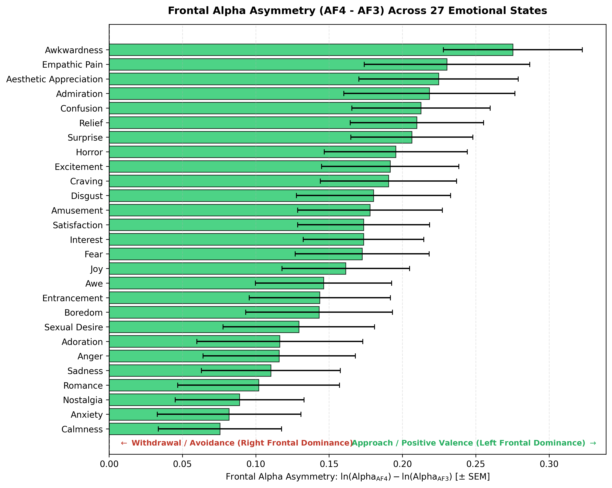

### 2. Multi-Band Scalp Topographies (10-20 System)
Interpolated 2D scalp power maps across Delta (1-4 Hz), Theta (4-8 Hz), Alpha (8-13 Hz), Beta (13-30 Hz), and Gamma (30-45 Hz):
* Joy (High Valence, High Arousal):
  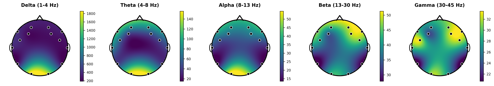
* Calmness (High Valence, Low Arousal):
  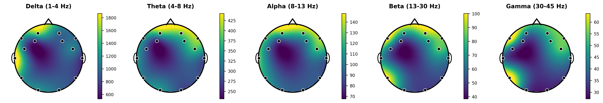
* Anger (Low Valence, High Arousal):
  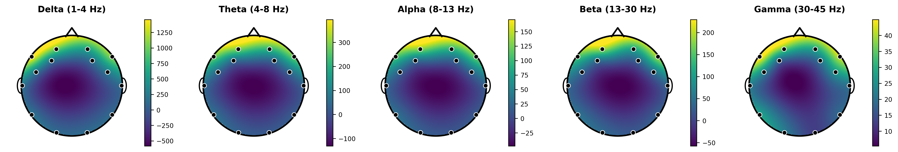
* Sadness (Low Valence, Low Arousal):
  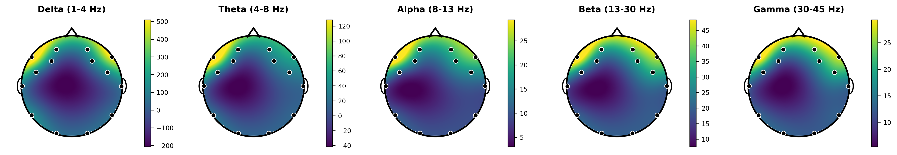

### 3. Manifold Learning & Representational Geometry
* Diffusion / Laplacian Eigenmaps:
  Low-dimensional non-linear diffusion coordinates revealing the grouping of affective states:
  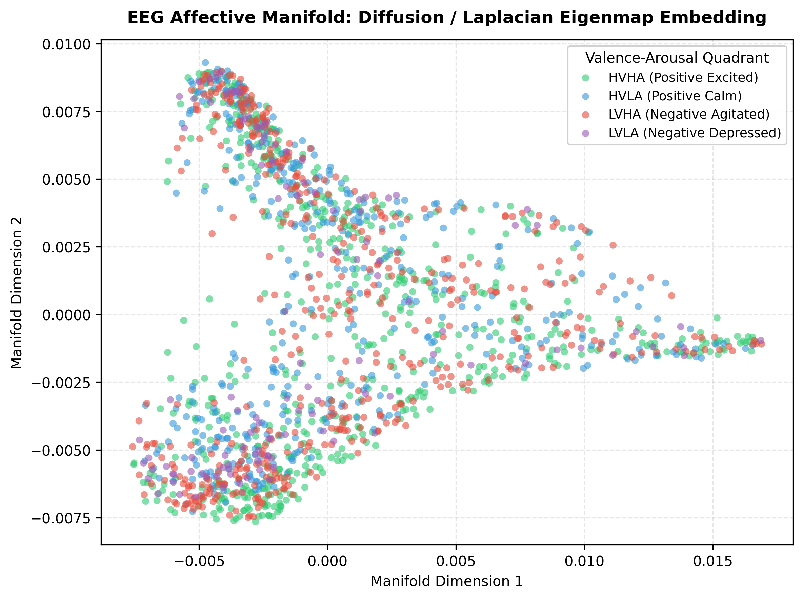

* Pairwise Neural Distance Matrix (27 Emotions):
  Euclidean distance heatmap between emotion centroids in 462-dimensional space:
  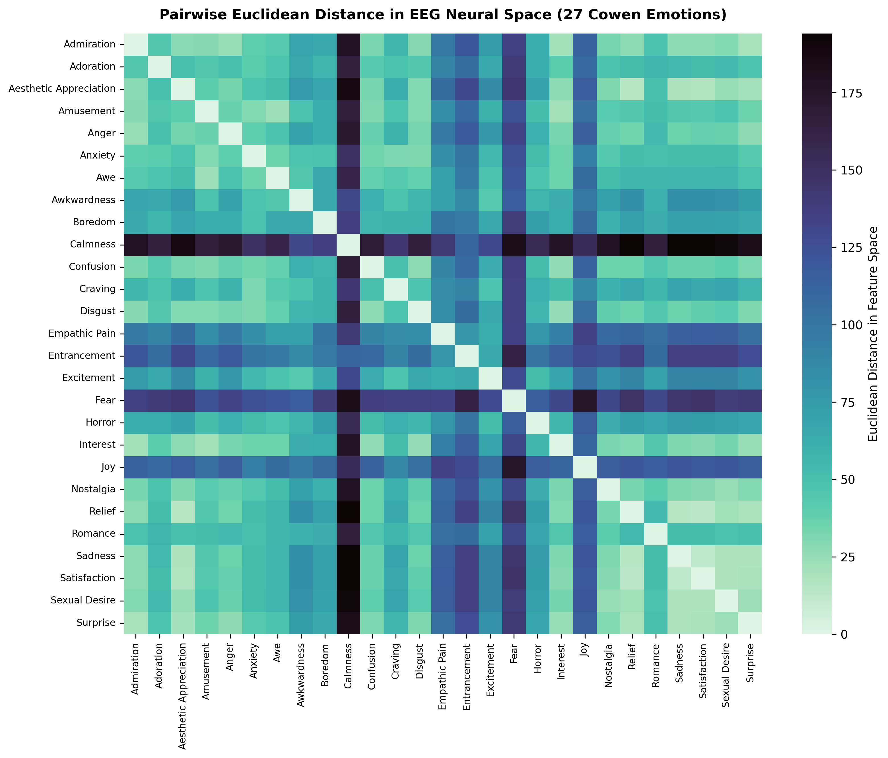

* Hierarchical Ward Dendrogram:
  Brain state hierarchical taxonomy illustrating which emotional states share neural activation patterns:
  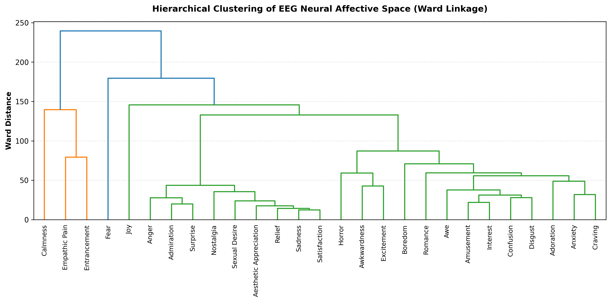

### 4. Decoding Confusion Matrices
* Valence-Arousal Quadrants:
  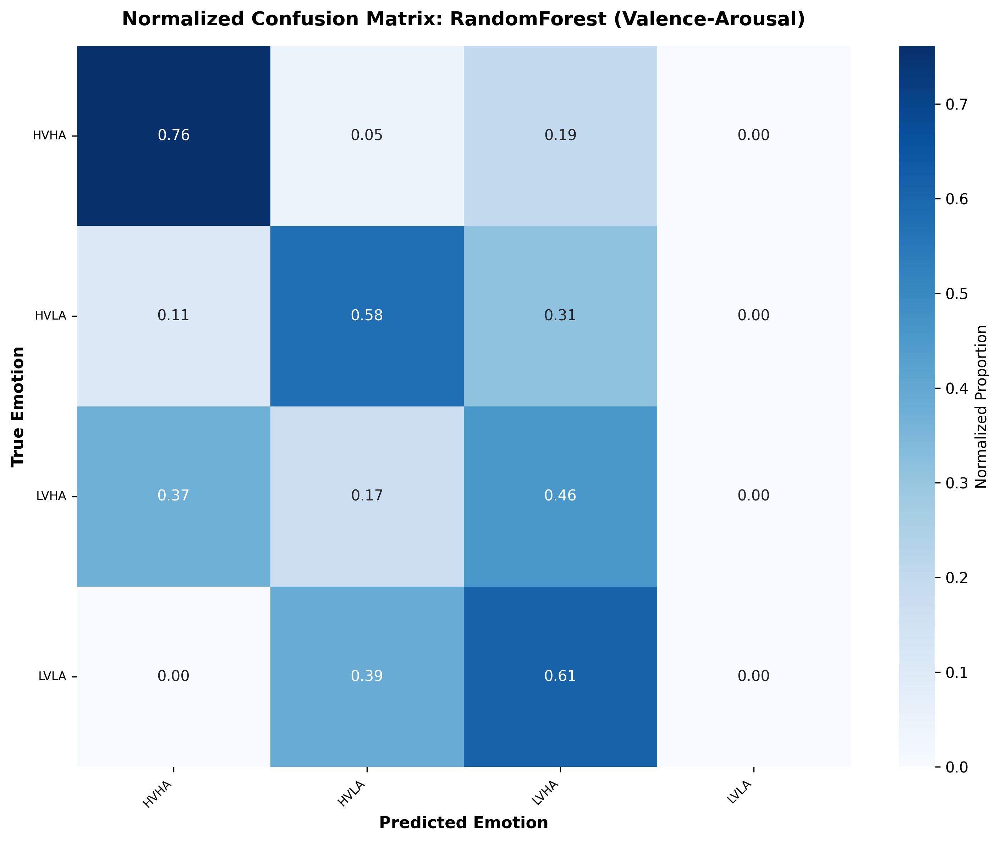
* 27 Fine-Grained Emotions:
  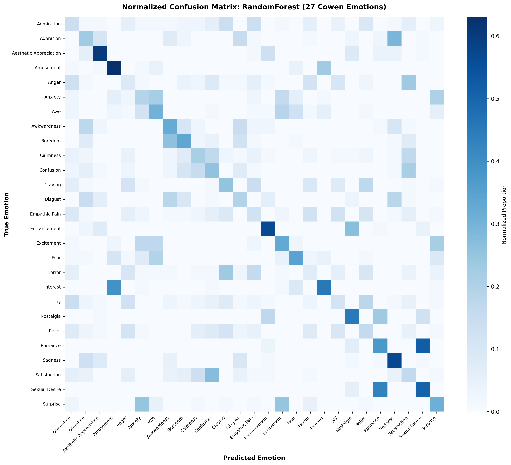

### 5. Neuro-Feature Importance
Gini impurity reduction partitioned by spectral band and anatomical cortical lobe:
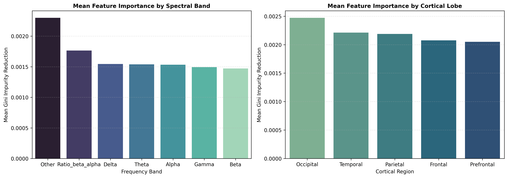

### 6. Class-Conditional Synthetic Generation
PCA projection showing overlap between held-out empirical EEG test data and synthetic feature vectors generated via Ledoit-Wolf covariance shrinkage:
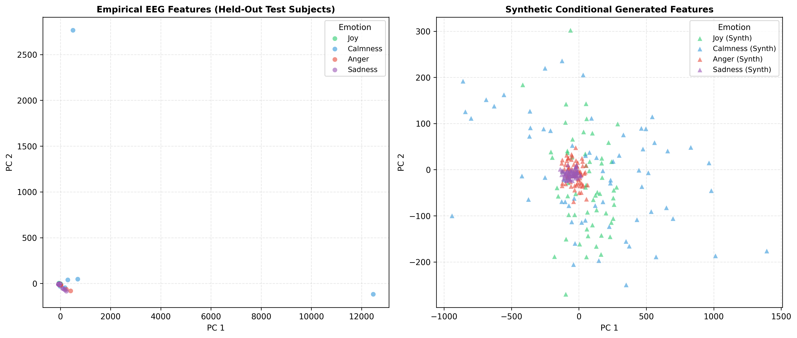

---

## Repo Structure

```
Research_Tryout/
├── .gitignore                      # Excludes raw recordings & caches
├── LICENSE                         # MIT License
├── README.md                       # Documentation & research report
├── requirements.txt                # Python dependencies
├── pyproject.toml                  # Packaging configuration
├── setup.py                        # Package setup script
│
├── eeg_affect/                     # Core Python Library
│   ├── config.py                   # Electrodes, labels & circumplex coords
│   ├── data/                       # Loaders, preprocessors & group splits
│   ├── features/                   # Spectral power, FAA & Hjorth stats
│   ├── geometry/                   # Diffusion maps, RSA & Two-NN dim
│   ├── models/                     # Classifiers (Linear, SVM, MLP)
│   ├── evaluation/                 # Benchmark metrics & scoring
│   ├── generative/                 # Conditional generator (Ledoit-Wolf)
│   └── visualization/              # Scalp topomaps, manifolds & dendrograms
│
├── scripts/                        # Standalone Reproduction Scripts
│   ├── 01_neurobiology_topography.py
│   ├── 02_manifold_rsa_topology.py
│   ├── 03_decoding_benchmark.py
│   ├── 04_conditional_generation.py
│   └── run_all.py                  # One-click master pipeline runner
│
├── tests/                          # Automated Test Suite (15 unit tests)
│   └── run_tests.py                # Zero external dependency test runner
│
├── notebooks/                      # Interactive Jupyter Walkthrough
│   └── 01_exploratory_eeg_affect_walkthrough.ipynb
│
├── memos/                          # Research Memo & Formal Reports
│   └── 2026-09-07-eeg-affect-manifold-geometry/
│       ├── index.pdf               # Compiled formal PDF memo
│       ├── index.html              # Interactive web version with hovercards
│       └── index.qmd               # Quarto source document
│
├── figures/                        # 14 publication 300-DPI plots & JSON metrics
└── data/                           # Extracted features & metadata
```

---

## Quick Start and Reproduction Instructions

### 1. Installation
Clone the repository and install dependencies:
```bash
git clone https://github.com/<your-username>/EEG-Affect-Geometry.git
cd EEG-Affect-Geometry

# Install dependencies
pip install -r requirements.txt
# Or install in editable mode
pip install -e .
```

### 2. Run All Experiments (One-Click Reproduction)
Execute the complete four-stage pipeline end-to-end:
```bash
python scripts/run_all.py
```
This runs:
1. `scripts/01_visualize_neurobiology.py`: Produces 10-20 scalp topomaps, Frontal Alpha Asymmetry bar plots, and raw time-series/PSD plots.
2. `scripts/02_analyze_manifold_geometry.py`: Computes 2D Diffusion/PCA embeddings, pairwise neural distance matrix, RSA test against psychological circumplex, Ward dendrogram, and Two-NN intrinsic dimensionality.
3. `scripts/03_run_decoding_benchmark.py`: Runs cross-subject evaluation across 6 model paradigms on both 4-class quadrants and 27 Cowen emotions; computes top-k accuracies and feature importances.
4. `scripts/04_generate_synthetic_eeg.py`: Fits class-conditional multivariate models with Ledoit-Wolf shrinkage, generates synthetic feature vectors, and computes Fréchet distance fidelity.

### 3. Run Automated Unit Tests
Verify all components with zero external test runners:
```bash
python tests/run_tests.py
```
*(All 15 unit tests across data loaders, feature engineering, manifold algorithms, and models pass.)*

### 4. Interactive Jupyter Notebook
Launch the interactive tutorial walkthrough:
```bash
jupyter notebook notebooks/01_exploratory_eeg_affect_walkthrough.ipynb
```


## References

1. Dataset Paper: Phuong, H.-T., Im, E.-T., Oh, M.-S., & Gim, G.-Y. (2025). *EEGEmotions-27: A Large-Scale EEG Dataset Annotated With 27 Fine-Grained Emotion Labels*. IEEE Access, 13, 176915-176932. [DOI: 10.1109/ACCESS.2025.3620677](https://doi.org/10.1109/ACCESS.2025.3620677)
2. Review Paper: Phuong, H.-T., Im, E.-T., Oh, M.-S., & Gim, G.-Y. (2025). *EEG-Based Emotion Recognition: A Review and Emerging Paths*. IEEE Access, 13, 165037-165060. [DOI: 10.1109/ACCESS.2025.3610918](https://doi.org/10.1109/ACCESS.2025.3610918)
3. Affective Geometry: Cowen, A. S., & Keltner, D. (2017). *Self-report captures 27 distinct categories of emotion bridged by continuous gradients*. Proceedings of the National Academy of Sciences (PNAS), 114(38), E7900-E7909. [DOI: 10.1073/pnas.1702247114](https://doi.org/10.1073/pnas.1702247114)
4. Frontal Asymmetry: Davidson, R. J. (1992). *Anterior cerebral asymmetry and the nature of emotion*. Brain and Cognition, 20(1), 125-151. [DOI: 10.1016/0278-2626(92)90014-M](https://doi.org/10.1016/0278-2626(92)90014-M)
5. Intrinsic Dimensionality: Facco, E., d'Errico, M., Rodriguez, A., & Laio, A. (2017). *Estimating the intrinsic dimension of datasets by a minimal neighborhood information*. Scientific Reports, 7(1), 12140. [DOI: 10.1038/s41598-017-11873-y](https://doi.org/10.1038/s41598-017-11873-y)
6. Representational Similarity: Kriegeskorte, N., Mur, M., & Bandettini, P. A. (2008). *Representational similarity analysis - connecting the branches of systems neuroscience*. Frontiers in Systems Neuroscience, 2, 4. [DOI: 10.3389/neuro.06.004.2008](https://doi.org/10.3389/neuro.06.004.2008)
7. Frontal Alpha Asymmetry: Coan, J. A., & Allen, J. J. (2004). *Frontal EEG asymmetry as a moderator and mediator of emotion*. Biological Psychology, 67(1-2), 7-49. [DOI: 10.1016/j.biopsycho.2004.03.002](https://doi.org/10.1016/j.biopsycho.2004.03.002)
8. Approach-Withdrawal: Harmon-Jones, E., Gable, P. A., & Peterson, C. K. (2010). *The role of asymmetric frontal cortical activity in emotion-related phenomena: A review and update*. Biological Psychology, 84(3), 451-462. [DOI: 10.1016/j.biopsycho.2009.08.010](https://doi.org/10.1016/j.biopsycho.2009.08.010)
9. Covariance Regularization: Ledoit, O., & Wolf, M. (2004). *A well-conditioned estimator for large-dimensional covariance matrices*. Journal of Multivariate Analysis, 88(2), 365-411. [DOI: 10.1016/S0047-259X(03)00096-4](https://doi.org/10.1016/S0047-259X(03)00096-4)
10. Circumplex Affect: Russell, J. A. (1980). *A circumplex model of affect*. Journal of Personality and Social Psychology, 39(6), 1161-1178. [DOI: 10.1037/h0077714](https://doi.org/10.1037/h0077714)
11. Laplacian Eigenmaps: Belkin, M., & Niyogi, P. (2003). *Laplacian eigenmaps for dimensionality reduction and data representation*. Neural Computation, 15(6), 1373-1396. [DOI: 10.1162/089976603321780317](https://doi.org/10.1162/089976603321780317)
12. Manifold Trajectory: Moon, K. R., et al. (2019). *Visualizing structure and transitions in high-dimensional biological data*. Nature Biotechnology, 37(12), 1482-1492. [DOI: 10.1038/s41587-019-0336-3](https://doi.org/10.1038/s41587-019-0336-3)

---

## Github License
This project is released under the [MIT License](LICENSE).
The underlying EEGEmotions-27 dataset is distributed under the [CC BY-NC 4.0 License](https://creativecommons.org/licenses/by-nc/4.0/).
